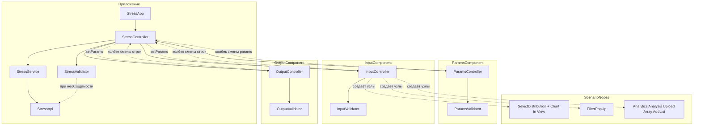

# Слои архитектуры StressNew

Цель: у каждого **функционального блока** (Params, Input, Output) — **своя папка** и понятное **внутреннее разделение ролей**, а не один «комбайн» на весь экран.

---

## 1. Уровень приложения (корень `StressNew/`)

| Слой / модуль | Файл | Задача |
|---------------|------|--------|
| **Точка входа** | `StressApp.js` | `new StressApp(bi, foreKeys)` — создаёт `StressController`, `bindView` → `StressView`. |
| **Оболочка** | `StressApp.js` | **`StressApp(bi, foreKeys)`** → **`StressController`**; **`bindView`** → **`StressView`** (кнопки шапки). |
| **Координатор** | `StressController.js` | **`StressController(bi, foreKeys)`**; создаёт `StressApi`, `StressService`, **`StressValidator`**, три блока; **`setMessages`** → блоки + **`setScenarioUi`** (п.21 T4). |
| **Сквозная валидация** | `StressValidator.js` | Агрегация локальных ошибок + правила сценария между блоками (п.15+). |
| **StressApi / bi** | `StressApi.js` | Единственное место вызовов `bi.getResultForeModule` (клиент **Foresight** / Fore); прикладной модуль стресс-теста; имена методов — `StressApi.MODULE_METHOD`, сигнатуры — [STRESS_API.md](STRESS_API.md) (п.7). |
| **Сценарии** | `StressService.js` | Преобразует агрегат данных формы в аргументы методов API (позже — как в legacy `getStressParams`). Сценарии запуска/сохранения возвращают контракт **`{ ok, messages, raw }`** через **`StressScenarioResult`** (п.21 T3). |
| **Контракт сообщений** | `StressScenarioResult.js` | **`mergeMessageZones`**, **`result`**, разбор валидации и ответов модуля; координатор вызывает **`setMessages`** после **`sendTest` / `saveTestState`** (T4). |
| **Представление страницы** | `StressView.js` | Кнопки шапки `[data-stress-action]` → **`StressController`** (`saveTestState`, `sendTest`, навигация). |
| **Заглушки** | *не используем на ранней стадии* | `stubs/` удалён, чтобы не путать структуру; UI/сервисы подтягиваются по плану. |

**Поток данных сверху вниз при запуске теста:**  
`StressApp` → `StressController.getData()` → блоки отдают свои данные → `StressService` → `StressApi` → сервер.

**Обратные уведомления снизу вверх:**  
блок вызывает **колбек**, переданный из `StressController` (например, смена параметров → `setParams` у Input и Output).

---

## 2. Блок Params (`ParamsComponent/`)

Каркас п.3: контроллер + валидатор + сервис + представление (заглушки методов до п.12).

| Слой внутри блока | Класс / файл | Ответственность |
|-------------------|--------------|-----------------|
| **Контроллер** | `ParamsController.js` | В конструктор передаётся **`ParamsService`** и колбек (не `StressApi`). Владеет `params`, `defaultParams()`, `setParams()`, `patchParams()`; `reloadForecastVersions()` → сервис. |
| **Валидация** | `ParamsValidator.js` | Локальные правила по `params` без доступа к API (T1). |
| **Сервис** | `ParamsService.js` | Вызовы через `StressApi` (версии прогноза и т.д.) — заглушки до п.8+. |
| **Представление** | `ParamsView.js` | Привязка к DOM (`bind()`) — п.12; только события в контроллер. |

Со стороны страницы: **`StressController.bindParams(root)`** → `ParamsController.bindView` → `ParamsView.bind` (T2 — View не экспортируется).

---

## 3. Блок Input (`InputComponent/`)

Отвечает за **строки ввода** показателей и связанные сценарии (распределение, файл, аналитики). Каркас п.4.

| Слой | Класс / файл | Ответственность |
|------|--------------|-----------------|
| **Контроллер** | `InputController.js` | В конструктор передаётся **`InputService`** и колбек. Владеет `indicators`, `setParams`, `setIndicators`, колбек; оркестрирует сервис и view (T1 — без поля `apiClient`). |
| **Валидация** | `InputValidator.js` | Локальные правила по строкам и `params` без API (T1). |
| **Сервис** | `InputService.js` | Распределение, файл и т.д. через `StressApi` — заглушки до п.8+. |
| **Представление** | `InputView.js` | `bind()` — привязка списка и кнопок (п.13, п.18–19). |

Со страницы: **`StressController.bindInput(root)`** → `InputController.bindView` → `InputView.bind` (T2).

---

## 4. Блок Output (`OutputComponent/`)

Каркас п.5, зеркально Input: Controller + Validator + Service + View.

| Слой | Класс / файл | Ответственность |
|------|--------------|-----------------|
| **Контроллер** | `OutputController.js` | В конструктор передаётся **`OutputService`** и колбек. Владеет `indicators`, `setParams`, `setIndicators`, `applyIndicator`; ScenarioNodes: Analytics, Analysis, FilterPopUp, AddList. |
| **Валидация** | `OutputValidator.js` | Локальные правила без API (T1). |
| **Сервис** | `OutputService.js` | `loadOutputIndicators`, `parseUploadedOutputIndicators` — заглушки до п.8+. |
| **Представление** | `OutputView.js` | `bind()` — п.14. |

Со страницы: **`StressController.bindOutput(root)`** → `OutputController.bindView` → `OutputView.bind` (T2).

---

## 5. Сценарные узлы (`ScenarioNodes/`) — п.6

Подузлы сценария (выбор распределения, график, всплывающие окна), которые **не** являются отдельными «большими блоками» Params / Input / Output, но вызываются из **Input** (и при необходимости Output) по событиям UI.

| Папка | Назначение |
|-------|------------|
| **`SelectDistribution/`** | Подбор распределения, график ECharts, search/add distribution — `SelectDistributionController` → Service / Validator / View. |
| **`FilterPopUp/`** | Фильтры списка (`filtering*`) — два экземпляра в Input/Output. |
| **`AnalyticsPopUp/`** … **`ArrayDataPopUp/`** | Четыре папки попапов: `*Controller` + `*Service` + `*Validator` + `*View`. |
| **`AddListIndicators/`** | Копирование списка Input/Output из другой версии. |

**График:** отдельной папки `Chart/` нет — ECharts в `SelectDistributionView`.

**Связь:** страница по-прежнему монтирует только три блока через `StressController`. Узлы из `ScenarioNodes/` подключаются скриптами страницы (глобальные классы) и создаются из **`InputController`** / view при п.13 — без обязательного упоминания в `StressIndex.js`.

---

## 6. Схема «кто кого знает»

**Итог:** координатор **не** лезет внутрь DOM блоков; блоки **не** дергают друг друга напрямую — только через переданные контракты и колбеки. Узлы **`ScenarioNodes`** создаются в зоне Input (или view) при интеграции п.13; у блоков Params/Input/Output доступ к модулю — через **сервисы**, создаваемые в `StressController` с общим `StressApi`.
